# Computational Geometry in Python

*Computational Geometry* is a field of mathematics that seeks the development of
efficient algorithms to solve problems described in terms of basic geometrical
objects.  We differentiate between *Combinatorial Computational Geometry* and
*Numerical Computational Geometry*.

* Combinatorial Computational Geometry deals with interaction of basic
geometrical objects: points, segments, lines, polygons, and polyhedra.  In this
setting we have three categories of problems:

    * *Static Problems*: The construction of a known target object is required
from a set of input geometric objects.

    * *Geometric Query Problems*:  Given a set of known objects (the *search
space*) and a sought property (the *query*), these problems deal with the search
of objects that satisfy the query.

    * *Dynamic Problems*: Similar to problems from the previous two categories,
with the added challenge that the input is not known in advance, and objects are
inserted or deleted between queries/constructions.

* Numerical Computational Geometry deals mostly with representation of objects
in space described by means of curves, surfaces, and regions in space bounded by
those.

Before we proceed to the development and analysis of the different algorithms in
those two settings, it pays off to explore the basic background: Plane Geometry.

## Plane Geometry

The basic Geometry capabilities are usually treated through the Geometry module
of the `sympy` libraries.  Rather than giving an academical description of all
objects and properties in that module, we discover the most useful ones through
a series of small self-explanatory `python` sessions.

### Points, Segments

We start with the concepts of *point* and *segment*.  The aim is to illustrate
how easily we can check for collinearity, compute lengths, midpoints, or slopes
of segments, for example.  We also show how to quickly compute the angle between
two segments, as well as deciding whether a given point belongs to a segment or
not.  The next diagram illustrates an example, which we follow up with code.

    from sympy.geometry import *
    
    P1 = Point(0, 0)
    P2 = Point(3, 4)
    P3 = Point(2, -1)
    P4 = Point(-1, 5)
    
    S1 = Segment(P1, P2)
    S2 = Segment(P3, P4)

    Point.is_collinear(P1, P2, P3)

    False

    S1.length

    5

    S2.midpoint

    Point(1/2, 2)

    S1.slope

    4/3

    S1.intersection(S2)

    [Point(9/10, 6/5)]

    Segment.angle_between(S1, S2)

    acos(-sqrt(5)/5)

    S1.contains(P3)

    False

### Lines

The next logical geometrical concept is the *line*.  We can perform more
interesting operations with lines, and to that effect we have a few more
constructors.  We can find their equations, compute the distance between a point
and a line, and many other operations.

    L1 = Line(P1, P2)
    
    L2 = L1.perpendicular_line(P3)  # perpendicular line to L1

    L2.arbitrary_point()            # parametric equation of L2

    Point(4*t + 2, -3*t - 1)

    L2.equation()                   # algebraic equation of L2

    3*x + 4*y - 2

    L2.contains(P4)                 # is P4 in L2?

    False

    L2.distance(P4)                 # distance from P4 to L2

    3

    L1.is_parallel(S2)              # is S2 parallel to L1?

    False

### Circles

The next geometrical concept we are to explore is the *circle*.  We may define a
circle by its center and radius, or by three points on it.  We can easily
compute all of its properties.

    C1 = Circle(P1, 3)
    C2 = Circle(P2, P3, P4)

    C2.area

    1105*pi/98

    C2.radius

    sqrt(2210)/14

    C2.equation()

    (x - 5/14)**2 + (y - 27/14)**2 - 1105/98

    C2.center

    Point(5/14, 27/14)

    C2.circumference

    sqrt(2210)*pi/7

Computing intersections with other objects, checking whether a line is tangent
to a circle, or finding the tangent lines through an non-interior point, are
simple tasks too:

    C2.intersection(C1)

    [Point(55/754 + 27*sqrt(6665)/754, -5*sqrt(6665)/754 + 297/754),
     Point(-27*sqrt(6665)/754 + 55/754, 297/754 + 5*sqrt(6665)/754)]

    C2.intersection(S1)

    [Point(3, 4)]

    C2.is_tangent(L2)

    False

    C1.tangent_lines(P4)

    [Line(Point(-1, 5), Point(-9/26 + 15*sqrt(17)/26, 3*sqrt(17)/26 + 45/26)),
     Line(Point(-1, 5), Point(-15*sqrt(17)/26 - 9/26, -3*sqrt(17)/26 + 45/26))]

### Triangles

The most useful basic geometric concept is the *triangle*.   We need robust and
fast algorithms to manipulate and extract information from them.  Let us show
first the definition of one, together with a series of queries to describe its
properties:

    T = Triangle(P1, P2, P3)

    T.area                          # Note it gives a signed area

    -11/2

    T.angles

    {Point(0, 0): acos(2*sqrt(5)/25),
     Point(2, -1): acos(3*sqrt(130)/130),
     Point(3, 4): acos(23*sqrt(26)/130)}

    T.sides

    [Segment(Point(0, 0), Point(3, 4)),
     Segment(Point(2, -1), Point(3, 4)),
     Segment(Point(0, 0), Point(2, -1))]

    T.perimeter

    sqrt(5) + 5 + sqrt(26)

    T.is_right()                    # Is T a right triangle?

    False

    T.is_equilateral()              # Is T equilateral?

    False

    T.is_scalene()                  # Is T scalene?

    True

    T.is_isosceles()                # Is T isosceles?

    False

Next, note how easily we can obtain representation of the different segments,
centers, and circles associated with triangles, as well as the *medial triangle*
(the triangle with vertices at the midpoints of the segments).

    T.altitudes

    {Point(0, 0): Segment(Point(0, 0), Point(55/26, -11/26)),
     Point(2, -1): Segment(Point(6/25, 8/25), Point(2, -1)),
     Point(3, 4): Segment(Point(4/5, -2/5), Point(3, 4))}

    T.orthocenter                  # Intersection of the altitudes

    Point(10/11, -2/11)

    T.bisectors()                  # Angle bisectors

    {Point(0, 0): Segment(Point(0, 0), Point(sqrt(5)/4 + 7/4, -9/4 + 5*sqrt(5)/4)),
     Point(2, -1): Segment(Point(3*sqrt(5)/(sqrt(5) + sqrt(26)), 4*sqrt(5)/(sqrt(5) + sqrt(26))), Point(2, -1)),
     Point(3, 4): Segment(Point(-50 + 10*sqrt(26), -5*sqrt(26) + 25), Point(3, 4))}

    T.incenter                     # Intersection of angle bisectors

    Point((3*sqrt(5) + 10)/(sqrt(5) + 5 + sqrt(26)), (-5 + 4*sqrt(5))/(sqrt(5) + 5 + sqrt(26)))

    T.incircle

    Circle(Point((3*sqrt(5) + 10)/(sqrt(5) + 5 + sqrt(26)), (-5 + 4*sqrt(5))/(sqrt(5) + 5 + sqrt(26))), -11/(sqrt(5) + 5 + sqrt(26)))

    T.inradius

    -11/(sqrt(5) + 5 + sqrt(26))

    T.medians

    {Point(0, 0): Segment(Point(0, 0), Point(5/2, 3/2)),
     Point(2, -1): Segment(Point(3/2, 2), Point(2, -1)),
     Point(3, 4): Segment(Point(1, -1/2), Point(3, 4))}

    T.centroid                   # Intersection of the medians

    Point(5/3, 1)

    T.circumcenter               # Intersection of perpendicular bisectors

    Point(45/22, 35/22)

    T.circumcircle

    Circle(Point(45/22, 35/22), 5*sqrt(130)/22)

    T.circumradius

    5*sqrt(130)/22

    T.medial

    Triangle(Point(3/2, 2), Point(5/2, 3/2), Point(1, -1/2))

Some other interesting operations with triangles:

* Intersection with other objects
* Computation of the minimum distance from a point to each of the segments.
* Checking whether two triangles are similar.

    T.intersection(C1)

    [Point(9/5, 12/5), Point(sqrt(113)/26 + 55/26, -11/26 + 5*sqrt(113)/26)]

    T.distance(T.circumcenter)

    sqrt(26)/11

    T.is_similar(Triangle(P1, P2, P4))

    False

> The other basic geometrical objects currently coded in the Geometry module are

> * `LinearEntity`.  This is a superclass (which we never use directly), with
three subclasses `Segment`, `Line` and `Ray`.  `LinearEntity` enjoys the
following basic methods:

>    * `are_concurrent(o1, o2, ..., on)`
>    * `are_parallel(o1, o2)`
>    * `are_perpendicular(o1, o2)`
>    * `parallel_line(self, Point)`
>    * `perpendicular_line(self, Point)`
>    * `perpendicular_segment(self, Point)`
>
>* `Ellipse`. An object with a center, together with horizontal and vertical
radii.  `Circle` is, as a matter of fact, a subclass of `Ellipse` with both
radii equal.
> * `Polygon`.  A superclass we can instantiate by listing a set of vertices.
Triangles are a subclass of `Polygon`, for example.  The basic methods of
`Polygon` are

>    * `area`
>    * `perimeter`
>    * `centroid`
>    * `sides`
>    * `vertices`

>* `RegularPolygon`.  This is a subclass of `Polygon`, with extra attributes:

>    * `apothem`
>    * `center`
>    * `circumcircle`
>    * `exterior_angle`
>    * `incircle`
>    * `interior_angle`
>    * `radius`

>For more information about this module, refer to the official `sympy`
documentation at [docs.sympy.org/dev/modules/geometry.html](http://docs.sympy.or
g/dev/modules/geometry.html)

### Curves

There is also a _non-basic_ geometric object: A `Curve`, which we define by
providing parametric equations, together with the interval of definition of the
parameter.  It currently does not have many useful methods, other than those
describing its constructors.  Let us illustrate how to deal with these objects.
For example, a three-quarters arc of an ellipse could be coded as follows:

    from sympy import var, pi, sin, cos
    
    var('t', real=True)
    
    Arc = Curve((3*cos(t), 4*sin(t)), (t, 0, 3*pi/4))

### Affine Transformations

To end the exposition on basic objects from the geometry module in the `sympy`
library, we must mention that we may apply any basic affine transformations to
any of the previous objects.  This is done by combination of the methods
`reflect`, `rotate`, `translate` and `scale`.

    T.reflect(L1)

    Triangle(Point(0, 0), Point(3, 4), Point(-38/25, 41/25))

    T.rotate(pi/2, P2)

    Triangle(Point(7, 1), Point(3, 4), Point(8, 3))

    T.translate(5,4)

    Triangle(Point(5, 4), Point(8, 8), Point(7, 3))

    T.scale(9)

    Triangle(Point(0, 0), Point(27, 4), Point(18, -1))

    Arc.rotate(pi/2, P3).translate(pi,pi).scale(0.5)

    Curve((-2.0*sin(t) + 0.5 + 0.5*pi, 3*cos(t) - 3 + pi), (t, 0, 3*pi/4))

With these basic definitions and operations, we are ready to address more
complex situations.  Let us explore these new challenges next.

## Combinatorial Computational Geometry

Also called *algorithmic geometry*, the applications of this field are plenty:
in robotics, these are used to solve visibility problems, and motion planning,
for instance.  Similar applications are employed to design route planning or
search algorithms in *geographic information systems* (*GIS*).

Let us describe the different categories of problems, making emphasis on the
tools for solving them that are available in the `scipy` stack.

### Static Problems

The fundamental problems in this category are the following:

* *Convex hulls*:  Given a set of points in space, find the smallest convex
polyhedron containing them.
* *Voronoi diagrams*:  Given a set of points in space (the _seeds_), compute a
partition in regions consisting of all points closer to each seed.
* *Triangulations*:  Partition the plane with triangles, in a way that two
triangles are either disjoint, or otherwise they share an edge or a vertex.
There are different triangulations depending on the input objects, or
constraints on the properties of the triangles.
* *Shortest paths*: Given a set of obstacles in a space, and two points, find
the shortest path between the points that does not intersect any of the
obstacles.

> The problems of computation of convex hulls, basic triangulations, and Voronoi
diagrams are intimately linked.  The theory that explains this beautiful topic
is explained in detail in a monograph in Computer Science titled _Computational
Geometry_, written by Franco Preparata and Michael Shamos.  It was published by
Springer-Verlag in 1985.

#### Convex Hulls

While it is possible to compute the convex hull of a reasonably large set of
points in the plane through the geometry module of the library `sympy`, this is
not recommendable.  A much faster and reliable code is available in the module
`scipy.spatial` through the routine `ConvexHull`, which is in turn a wrapper to
`qconvex`, from the `Qhull` libraries [www.qhull.org](www.qhull.org).  This
routine also allows the computation of convex hulls in higher dimensions.   Let
us compare both methods, with the famous *Lake Superior* polygon,
`superior.poly`.

> `poly` files represent *planar straight line graphs*---a simple list of
vertices and edges, together with information about holes and concavities, in
some cases.  The running example can be downloaded from
[www.math.sc.edu/~blanco/superior.poly](www.math.sc.edu/~blanco/superior.poly).
It contains a polygonal description of the coastline of Lake Superior, with 7
holes (for the islands), 518 vertices, and 518 edges.

> For a complete description of the `poly` format, refer to [www.cs.cmu.edu/~qua
ke/triangle.poly.html](www.cs.cmu.edu/~quake/triangle.poly.html).  With that
information, we can write  a simple reader without much effort.  This is an
example:

    from numpy import array
    
    def read_poly(file_name):
        """
        Simple poly-file reader, that creates a python dictionary 
        with information about vertices, edges and holes.
        It assumes that vertices have no attributes or boundary markers.
        It assumes that edges have no boundary markers.
        No regional attributes or area constraints are parsed.
        """
    
        output = {'vertices': None, 'holes': None, 'segments': None}
    
        # open file and store lines in a list
        file = open(file_name, 'r')
        lines = file.readlines()
        file.close()
        lines = [x.strip('\n').split() for x in lines]
    
        # Store vertices
        vertices= []
        N_vertices, dimension, attr, bdry_markers = [int(x) for x in lines[0]]
        # We assume attr = bdrt_markers = 0
        for k in range(N_vertices):
            label, x, y = [items for items in lines[k+1]]
            vertices.append([float(x), float(y)])
        output['vertices']=array(vertices)
    
        # Store segments
        segments = []
        N_segments, bdry_markers = [int(x) for x in lines[N_vertices+1]]
        for k in range(N_segments):
            label, pointer_1, pointer_2 = [items for items in lines[N_vertices+k+2]]
            segments.append([int(pointer_1)-1, int(pointer_2)-1])
        output['segments'] = array(segments)
    
        # Store holes
        N_holes = int(lines[N_segments+N_vertices+2][0])
        holes = []
        for k in range(N_holes):
            label, x, y = [items for items in lines[N_segments + N_vertices + 3 + k]]
            holes.append([float(x), float(y)])
    
        output['holes'] = array(holes)
    
        return output

    import numpy as np
    
    from scipy.spatial import ConvexHull
    
    import matplotlib.pyplot as plt
    
    %matplotlib inline

    lake_superior = read_poly("../chapter6/superior.poly")
    
    vertices_ls = lake_superior['vertices']

    %time hull = ConvexHull(vertices_ls)

    CPU times: user 413 µs, sys: 213 µs, total: 626 µs
    Wall time: 372 µs

    plt.figure(figsize=(14, 14))
    plt.xlim(vertices_ls[:,0].min()-0.01, vertices_ls[:,0].max()+0.01)
    plt.ylim(vertices_ls[:,1].min()-0.01, vertices_ls[:,1].max()+0.01)
    plt.axis('off')
    plt.axes().set_aspect('equal')
    plt.plot(vertices_ls[:,0], vertices_ls[:,1], 'b.')
    for simplex in hull.simplices:
        plt.plot(vertices_ls[simplex, 0], vertices_ls[simplex, 1], 'r-')
        
    plt.show()

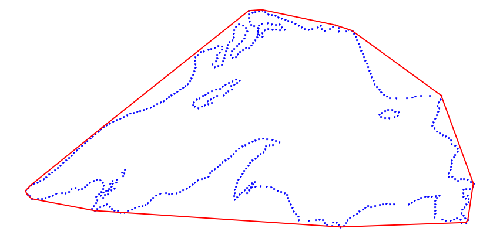

#### Voronoi Diagrams 

Computing the Voronoi diagram of a set of vertices (our _seeds_) can be done
with the routine `Voronoi` (and its companion `voronoi_plot_2d` for
visualization) from the module `scipy.spatial`.  The routine `Voronoi` is in
turn a wrapper to the function `qvoronoi`  from the `Qhull` libraries, with the
following default `qvoronoi` controls: `qhull_option='Qbb Qc Qz Qx'` if the
dimension of the points is greater than 4, and `qhull_options='Qbb Qc Qz'`
otherwise.  For the computation of the *furthest-site Voronoi diagram*, instead
of the nearest-site, we would use the extra control `Qu`.

    from scipy.spatial import Voronoi, voronoi_plot_2d

    vor = Voronoi(vertices_ls)
    
    plt.figure(figsize=(8, 8))
    ax = plt.subplot(111, aspect='equal')
    voronoi_plot_2d(vor, ax=ax)
    plt.xlim( 0.45,  0.50)
    plt.ylim(-0.40, -0.35)
    plt.show()

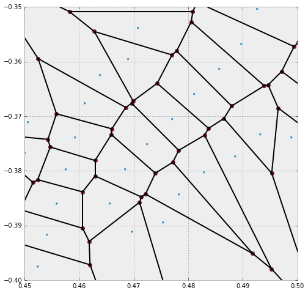

* The small dots are the original seeds with `x`-coordinates between `0.45` and
`0.50`, and `y`-coordinates between `-0.40` and `-0.35`.  We access those values
either from the original list `vertices_ls`, or from `vor.points`.
* The plane gets partitioned into different regions (the Voronoi cells), one for
each seed.  These regions contain all points in the plane which are closest to
its seed.  Each region receives an index, which is not necessarily the same
index as the index of its seed in the `vor.points` list.  To access the
corresponding region to a given seed, we use `vor.point_region`.

    vor.point_region

    array([  0,  22,  24,  21,  92,  89,  91,  98,  97,  26, 218, 219, 220,
           217, 336, 224, 334, 332, 335, 324, 226, 231, 230, 453, 500, 454,
           235, 234, 333, 236, 341, 340,  93, 343, 339, 342, 237, 327, 412,
           413, 344, 337, 338, 138,  67, 272, 408, 404, 403, 407, 406, 405,
           268, 269, 270, 257, 271, 258, 259,   2, 260, 261, 263,  15,  70,
            72, 278, 275, 277, 276, 179, 273, 274, 204, 289, 285, 288, 318,
           317, 216, 215, 312, 313, 309, 310, 243, 151, 150, 364, 365, 244,
           433, 362, 360, 363, 361, 242, 308, 307, 314, 311, 316, 315, 319,
           284, 287, 286, 452, 451, 450, 482, 483, 409, 493, 486, 485, 484,
           510, 516, 517, 410, 494, 518, 512, 515, 511, 513, 514, 508, 509,
           487, 214, 488, 489, 432, 429, 431, 430, 359, 490, 491, 492, 144,
           146, 147, 145, 149, 148, 143, 140, 142, 139, 141, 463, 428, 357,
           427, 462, 459, 461, 460, 426, 240, 239, 241, 352, 356, 355, 421,
           423, 424, 420, 422,  46,  47,  48, 112,  33,  32,  31, 110, 106,
           107, 105, 109, 108, 114, 111, 113, 358, 115,  44,   6, 133, 132,
           135, 134,  45, 127, 128, 129, 136, 130, 125, 126,  41,  36,  37,
            40, 131,   7, 123, 120,  39,  38,   4,   8, 118, 116, 122, 124,
            35, 101,  34, 100,  99, 121, 119, 103, 117, 102,   5,   1,  29,
           104,  28,  30, 304, 305, 306, 137, 207, 238, 348, 349, 300, 303,
            57, 302,  58,   9, 158, 295, 301, 347, 345, 346, 416, 351, 162,
           161,  53, 159, 160,  19,  20,  55,  56,  49, 298, 296, 299, 297,
           292, 291, 294, 206, 157, 154, 156,  52,  51, 155, 293,  50,  83,
            82,  84,  85, 250, 249, 246, 248, 153, 245, 247, 152, 209, 208,
           213, 211, 212, 371, 372, 375, 374, 442, 445, 441, 444, 438, 446,
           439, 440, 468, 467, 465, 470, 471, 505, 507, 464, 252, 253, 379,
           382, 378, 478, 476, 449, 398, 447, 475, 474, 477, 383, 381, 384,
           437, 466, 434, 435, 254, 165, 436, 387, 386, 385, 479, 480, 481,
           448, 395, 399, 400, 401, 256, 281, 280, 255, 391, 390, 396, 397,
           388, 389, 394, 393, 392, 163, 164, 166,  76, 192, 283, 279, 282,
           194, 203, 202, 195, 196, 185, 189, 187, 190, 191,  78, 181, 180,
           182,  75,  71, 264, 262,  73,  74,  59,  63,  62,  60,  61,  66,
            64,  65,  11,  12,  10,  13,  14,  69,  68, 233, 232,  88, 225,
           228, 227, 322, 229, 323, 320, 321, 223, 222, 221,  27,  25,  95,
            94,  96,  90,  86,  87,   3, 328, 325, 326, 499, 495, 498, 458,
           496, 497, 411, 329, 501, 457, 330, 456, 455, 331, 267, 266, 265,
           183, 188, 186, 184, 198, 197, 201, 193, 170, 169, 171, 175, 176,
           177, 402, 380, 167, 173, 172, 174, 178, 168,  80,  79,  16, 200,
           199,  81,  18,  17, 205, 290,  77, 503, 469, 473, 443, 373, 376,
           366, 370, 369, 210, 251, 367, 368, 377, 472, 504, 506, 502, 354,
           353,  54,  42,  43, 350, 417, 414, 415, 418, 419, 425])

* Each Voronoi cell is defined by its delimiting vertices and edges (also known
as _ridges_ in Voronoi jargon).  The list with the coordinates of the computed
vertices of the Voronoi diagram can be obtained with `vor.vertices`.  These
vertices were represented as bigger dots in the previous image, and are easily
identifiable because they are always at the intersection of at least two edges
--- while the seeds have no incoming edges.

    vor.vertices

    array([[ 0.88382749, -0.23508215],
           [ 0.10607886, -0.63051169],
           [ 0.03091439, -0.55536174],
           ..., 
           [ 0.49834202, -0.62265786],
           [ 0.50247159, -0.61971784],
           [ 0.5028735 , -0.62003065]])

* For each of the regions, we can access the set of delimiting vertices with
`vor.regions`.  For instance, to obtain the coordinates of the vertices that
delimit the region around the 4th seed, we could issue

    [vor.vertices[x] for x in vor.regions[vor.point_region[4]]]

    [array([ 0.13930793, -0.81205929]),
     array([ 0.11638   , -0.92111088]),
     array([ 0.11638   , -0.63657789]),
     array([ 0.11862537, -0.6303235 ]),
     array([ 0.12364332, -0.62893576]),
     array([ 0.12405738, -0.62891987])]

Care must be taken with the previous step: Some of the vertices of the Voronoi
cells are not actual vertices, but lie _at infinity_.  When this is the case,
they are identified with the index `-1`.  In this situation, to provide an
accurate representation of a ridge of these characteristics we must use the
knowledge of the two seeds whose contiguous Voronoi cells intersect on said
ridge---since the ridge is perpendicular to the segment defined by those two
seeds.  We obtain the information about those seeds with `vor.ridge_points`

    vor.ridge_points

    array([[  0,   1],
           [  0, 433],
           [  0, 434],
           ..., 
           [124, 118],
           [118, 119],
           [119, 122]], dtype=int32)

The first entry of `vor.ridge_points` can be read as follows: There is a ridge
perpendicular to both the first and second seeds.

There are other attributes of the object `vor` that we may use to inquire
properties of the Voronoi diagram, but the ones we have described should be
enough to replicate the previous image.  We leave this as a nice exercise:

1. Gather the indices of the seeds from `vor.points` that have their `x`- and
`y`-coordinates in the required window.  Plot them.
2. For each of those seeds, gather information about vertices of their
corresponding Voronoi cells.  Plot those vertices not at the infity with a
different style as the seeds.
3. Gather information about the ridges of each relevant region, and plot them as
simple thin segments.  Some of the ridges cannot be represented by their two
vertices.  In that case, we use the information about the seeds that determine
them.

#### Triangulations

A *triangulation* of a set of vertices in the plane is a division of the convex
hull of the vertices into triangles, satisfying one important condition.  Any
two given triangles:

* must be disjoint, or
* must intersect only at one common vertex, or
* must share one common edge.

These plain triangulations have not much computational value, since some of its
triangles might be too skinny --- this leads to uncomfortable rounding errors,
or computation or erroneous areas, centers, etc.  Among all possible
triangulations, we always seek one where the properties of the triangles are
somehow balanced.

With this purpose in mind, we have the *Delaunay triangulation* of a set of
vertices.  This triangulation satisfies an extra condition: None of the vertices
lies in the interior of the circumcircle of any triangle.  We refer to triangles
with this property as *Delaunay triangles*.

For this simpler setting, in the module `scipy.spatial`, we have the routine
`Delaunay`, which is in turn a wrapper to the function `qdelaunay` from the
`Qhull` libraries, with the `qdelaunay` controls set exactly as for the Voronoi
diagram computations.

    from scipy.spatial import Delaunay, delaunay_plot_2d

    tri = Delaunay(vertices_ls)
    
    plt.figure(figsize=(14, 14))
    ax = plt.subplot(111, aspect='equal')
    delaunay_plot_2d(tri, ax=ax)
    plt.show()

It is possible to generate triangulations with imposed edges too.  Given a
collection of vertices and edges, a *constrained Delaunay triangulation* is a
division of the space into triangles with those prescribed features.  The
triangles in this triangulation are not necessarily Delaunay.

We can accomplish this extra condition sometimes by subdivision of each of the
imposed edges.  We call this triangulation *conforming Delaunay*, and the new
(artificial) vertices needed to subdivide the edges are called *Steiner points*.

A *constrained conforming Delaunay triangulation* of an imposed set of vertices
and edges satisfies a few more conditions, usually setting thresholds on the
values of angles or areas of the triangles.  This is achieved by introducing a
new set of *Steiner points*, which are allowed anywhere, not only on edges.

> To achieve these high-level triangulations, we need to step outside of the
`scipy` stack.  We have a `python` wrapper to the amazing implementation of mesh
generators
[www.cs.cmu.edu/~quake/triangle.html](www.cs.cmu.edu/~quake/triangle.html) by
Richard Shewchuck .  This wrapper, together with examples and other related
functions, can be installed by issuing

>        pip install triangle

> For more information on this module, refer to the documentation online from
its author, Dzhelil Rufat, at
[dzhelil.info/triangle/index.html](dzhelil.info/triangle/index.html)

Let us compute those different triangulations for our running example.  We use
once again the `poly` file with the features of Lake Superior, which we read
into a dictionary with all the information about vertices, segments and holes.
The first example is that of the constrained Delaunay triangulation (`cndt`).
We accomplish this task with the flag `p` (indicating that the source is a
_planar straight line graph_, rather than a set of vertices).

    from triangle import triangulate, plot as tplot

    cndt = triangulate(lake_superior, 'p')
    
    plt.figure(figsize=(14, 14))
    ax = plt.subplot(111, aspect='equal')
    tplot.plot(ax, **cndt)
    plt.show()

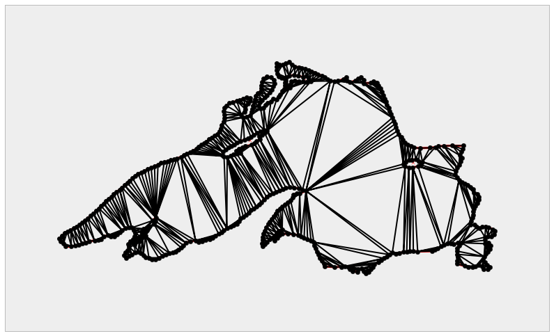

The next step is the computation of a conforming Delaunay triangulation
(`cfdt`).  We enforce Steiner points on some segments to ensure as many Delaunay
triangles as possible.  We achieve this with extra flag `D`.

    cfdt = triangulate(lake_superior, 'pD')

But slight or no improvements with respect to the previous diagram can be
observed in this case.  The real improvement arises when we further impose
constraints in the values of minimum angles on triangles (with the flag `q`), or
in the maximum values of the areas of triangles (with the flag 'a').  For
instance, if we require a constrained conforming Delaunay triangulation
(`cncfdt`) in which all triangles have a minimum angle of at least 20 degrees,
we issue the following command

    cncfq20dt = triangulate(lake_superior, 'pq20D')
    
    plt.figure(figsize=(14,14))
    ax = plt.subplot(111, aspect='equal')
    tplot.plot(ax, **cncfq20dt)
    plt.show()

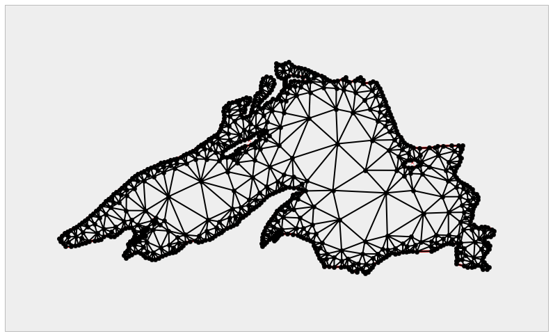

For the last example to conclude this section, we further impose a maximum area
on triangles.

    cncfq20adt = triangulate(lake_superior, 'pq20a.001D')
    
    plt.figure(figsize=(14, 14))
    ax = plt.subplot(111, aspect='equal')
    tplot.plot(ax, **cncfq20adt)
    plt.show()

#### Shortest Paths

We will use the last example to introduce a special setting of the problem of
shortest paths.  We pick a location in the North-West coast of the lake (say,
the vertex indexed as `370` in the original `poly` file), and the goal is to
compute the shortest path to the furthest South-East location on the shore, at
the bottom-right corner---this is the vertex indexed as `179` in the original
`poly` file.   By a _path_ in this setting, we mean a chain of edges of the
triangulation.

In the `scipy` stack we accomplish the computation of shortest paths on a
triangulation (and in some other similar geometries that can be coded by means
of graphs) by relying on two modules:

* `scipy.sparse` to store a weighted-adjacency matrix `G` representing the
triangulation.  Each non-zero entry `G[i,j]` of this adjacency matrix is
precisely the length of the edge from vertex `i` to vertex `j`.
* `scipy.sparse.csgraph`, the module that deals with *compressed sparse graphs*.
This module contains routines to analyze, extract information or manipulate
graphs.  Among these routines, we have several different algorithms to compute
shortest paths on a graph.

> For more information on the module `scipy.sparse.csgraph`, refer to the online
documentation at [docs.scipy.org/doc/scipy/reference/sparse.csgraph.html](docs.s
cipy.org/doc/scipy/reference/sparse.csgraph.html)

> For the theory and applications of Graph Theory, one of the best sources is
the introductory book by Reinhard Diestel, _Graph Theory_, published by
Springer-Verlag.

Let us illustrate this example with proper code.  We start by collecting the
indices of the vertices of all segments in the triangulation, and the lengths of
these segments.

    from scipy.spatial import minkowski_distance

    X = cncfq20adt['triangles'][:,0]
    Y = cncfq20adt['triangles'][:,1]
    Z = cncfq20adt['triangles'][:,2]
    
    Xvert = [cncfq20adt['vertices'][x] for x in X]
    Yvert = [cncfq20adt['vertices'][y] for y in Y]
    Zvert = [cncfq20adt['vertices'][z] for z in Z]
    
    lengthsXY = minkowski_distance(Xvert, Yvert)
    lengthsXZ = minkowski_distance(Xvert, Zvert)
    lengthsYZ = minkowski_distance(Yvert, Zvert)

We now create the weighted-adjacency matrix, which we store as a `lil_matrix`,
and compute the shortest path between the requested vertices.  We gather in a
list all the vertices included in the computed path, and plot the resulting
chain overlaid on the triangulation.

    from scipy.sparse import lil_matrix
    from scipy.sparse.csgraph import shortest_path

    nvert = len(cncfq20adt['vertices'])
    G = lil_matrix((nvert, nvert))

    for k in range(len(X)):
        G[X[k], Y[k]] = G[Y[k], X[k]] = lengthsXY[k]
        G[X[k], Z[k]] = G[Z[k], X[k]] = lengthsXZ[k]
        G[Y[k], Z[k]] = G[Z[k], Y[k]] = lengthsYZ[k]

    dist_matrix, pred = shortest_path(G, return_predecessors=True, directed=True, unweighted=False)

    index = 370
    path = [370]
    
    while index != 197:
        index = pred[197, index]
        path.append(index)
        
    Xs = [cncfq20adt['vertices'][x][0] for x in path]
    Ys = [cncfq20adt['vertices'][x][1] for x in path]

    plt.figure(figsize=(14,14))
    ax = plt.subplot(111, aspect='equal')
    tplot.plot(ax, **cncfq20adt)
    ax.plot(Xs, Ys, '-', linewidth=5, color='blue'); \
    plt.show()

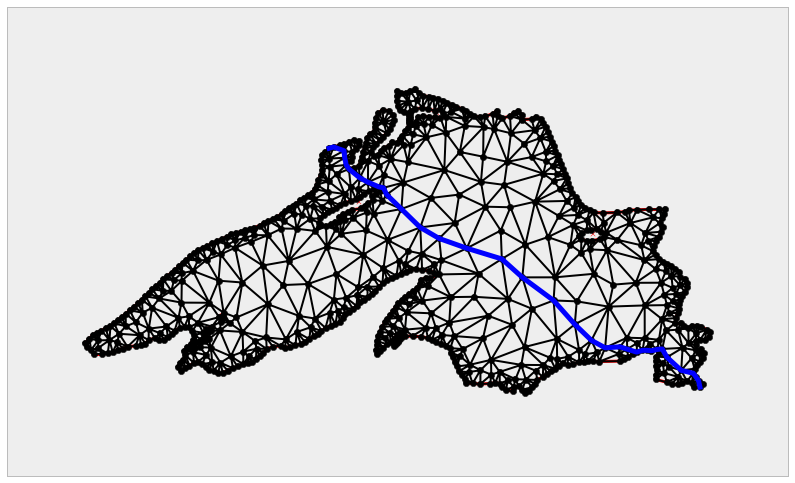

### Geometric Query Problems

The fundamental problems in this category are the following:

* Point Location.
* Nearest neighbor.
* Range searching.

#### Point Location

The problem of _point location_ is fundamental in Computational Geometry—given a
partition of the space into disjoint regions, we need to query the region that
contains a target location.

The most basic point location problems are those where the partition is given by
a single geometric object: a circle, or a polygon, for example. For those simple
objects that have been constructed through any of the classes in the module
`sympy.geometry`, we have two useful methods: `.encloses_point` and `.encloses`.

The former checks whether a point is interior to a source object (but not on the
border), while the latter checks whether another target object has all its
defining entities in the interior of the source object.

    P1 = Point(0, 0)
    P2 = Point(1, 0)
    P3 = Point(-1, 0)
    P4 = Point(0, 1)
    
    C = Circle(P2, P3, P4)
    T = Triangle(P1, P2, P3)

    C.encloses_point(P1)

    True

    C.encloses(T)

    False

Of special importance is this simple setting where the source object is a
polygon.  The routines in the `sympy.geometry` module get the job done, but at
the cost of too many resources and time.  A much faster way to approach this
problem is by using the `Path` class from the libraries of `matplotlib.path`.
Let us see how with a quick session: first, we create a representation of a
polygon as a `Path`.

    from matplotlib.path import Path

    my_polygon = Path([hull.points[x] for x in hull.vertices])

We may ask now whether a point (respectively, a sequence of points) is interior
to the polygon.  We accomplish this with either attribute `contains_point` or
`contains_points`.

    X = .25 * np.random.randn(100) + .5
    Y = .25 * np.random.randn(100) - .5

    my_polygon.contains_points([[X[k], Y[k]] for k in range(len(X))])

    array([ True, False,  True,  True,  True,  True, False, False,  True,
           False, False, False, False, False,  True, False, False, False,
            True,  True,  True,  True,  True, False, False, False, False,
            True,  True,  True,  True, False, False, False,  True, False,
           False, False, False, False, False, False,  True, False, False,
           False, False, False,  True, False, False, False, False, False,
           False, False, False,  True, False,  True, False, False, False,
            True,  True, False, False,  True, False,  True, False,  True,
            True, False,  True, False, False, False,  True, False, False,
           False, False, False,  True, False, False,  True, False, False,
            True, False, False,  True,  True, False, False,  True, False, False], dtype=bool)

More challenging point location problem arise when our space is partitioned by a
complex structure.  For instance, once a triangulation has been computed, and a
random location is considered, we need to query for the triangle where our
target location lies.  In the module `scipy.spatial` we have handy routines to
perform this task over Delaunay triangulations created with
`scipy.spatial.Delaunay`.  In the following example, we track the triangles that
contain a set of 100 random points in the domain.

    from scipy.spatial import tsearch

    tri = Delaunay(vertices_ls)
    
    points = zip(X, Y)
    
    tsearch(tri, points)

    array([274,  -1, 454, 647, 174,  10,  -1,  -1, 306,  -1,  -1,  -1,  -1,
            -1, 108,  -1,  -1,  -1, 988, 882, 174, 691, 115,  -1,  -1,  -1,
            -1, 373, 292, 647, 161,  -1,  -1,  -1, 104,  -1,  -1,  -1,  -1,
            -1,  -1,  -1, 454,  -1,  -1,  -1,  -1,  -1, 647,  -1,  -1,  -1,
            -1,  -1,  -1,  -1,  -1, 161,  -1, 138,  -1,  -1,  -1, 310, 602,
            -1,  -1,  11,  -1, 894,  -1, 108, 174,  -1, 819,  -1,  -1,  -1,
           180,  -1,  -1,  -1,  -1,  -1, 728,  -1,  -1,  11,  -1,  -1, 174,
            -1,  -1, 161, 126,  -1,  -1, 144,  -1,  -1], dtype=int32)

The same result is obtained with the method `.find_simplex` of the `Delaunay`
object `tri`.

    tri.find_simplex(points)

    array([274,  -1, 454, 647, 174,  10,  -1,  -1, 306,  -1,  -1,  -1,  -1,
            -1, 108,  -1,  -1,  -1, 988, 882, 174, 691, 115,  -1,  -1,  -1,
            -1, 373, 292, 647, 161,  -1,  -1,  -1, 104,  -1,  -1,  -1,  -1,
            -1,  -1,  -1, 454,  -1,  -1,  -1,  -1,  -1, 647,  -1,  -1,  -1,
            -1,  -1,  -1,  -1,  -1, 161,  -1, 138,  -1,  -1,  -1, 310, 602,
            -1,  -1,  11,  -1, 894,  -1, 108, 174,  -1, 819,  -1,  -1,  -1,
           180,  -1,  -1,  -1,  -1,  -1, 728,  -1,  -1,  11,  -1,  -1, 174,
            -1,  -1, 161, 126,  -1,  -1, 144,  -1,  -1], dtype=int32)

> Note that, when a triangle is found, the routine reports its corresponding
index in `tri.simplices`.  If no triangle is found (which means the point is
exterior to the convex hull of the triangulation), the index reported is `-1`.

#### Nearest Neighbors

The problem of finding the Voronoi cell that contains a given location is
equivalent to the search for the _nearest neighbor_ in a set of seeds.  We can
always perform this search with a brute force algorithm --- and this is
acceptable in some cases --- but in general, there are more elegant and less
complex approaches to this problem.   The key lies in the concept of *k-d
trees*: a special case of binary space partitioning structures for organizing
points, conductive to fast searches.

In the `scipy` stack we have an implementation of k-d trees, the `python` class
`KDTree`, in the module `scipy.spatial`.  This implementation is based on ideas
published in 1999 by Maneewongvatana and Mount.  It is initialized with the
location of our input points.  Once created, it can be manipulated and queried
with the following methods and attributes:

* Methods:

    * `data`: it presents the input
    * `leafsize`: the number of points at which the algorithm switches to brute-
force.  This value can be optionally offered in the initialization of the
`KDTree` object.
    * `m`: The dimension of the space where the points are located.
    * `n`: The number of input points.
    * `maxes`: It indicates the highest values of each of the coordinates of the
input points.
    * `mins`: It indicates the lowest values of each of the coordinates of the
input points.

* Attributes:

    * `query(self, Q, p=2.0)`: The attribute that searches for the nearest-
neighbor or a target location `Q`, using the structure of the k-d tree, with
respect to the Minkowski `p`-distance.
    * `query_ball_point(self, Q, r, p=2.0)`: A more sophisticated query that
outputs all points within Minkowski `p`-distance `r` from a target location `Q`
    * `query_pairs(self, r, p=2.0)`:  Find all pairs of points whose Minkowski
`p`-distance is at most `r`.
    * `query_ball_tree(self, other, r, p=2.0)`: similar to `query_pairs`, but
this attribute finds all pairs of points from two different k-d trees, which are
at a Minkowski `p`-distance of at least `r`.
    * `sparse_distance_matrix(self, other, max_distance)`: Computes a distance
matrix between two k-d trees, leaving as zero any distance greater than
`max_distance`.  The output is stored in a sparse `dok_matrix`.
    * `count_neighbors(self, other, r, p=2.0)`: This attribute is an
implementation of the *Two-point correlation* designed by Gray and Moore, to
count the number of pairs of points from two different kd-trees, which are at a
Minkowski `p`-distance not larger than `r`.  Unlike `query_ball`, this attribute
does not produce the actual pairs.

There is a faster implementation of this object created as an extension type in
`cyton`, the `cdef` class `cKDTree`.  The main difference is in the way the
nodes are coded on each case:

* For `KDTree`, the nodes are nested `python` classes (`node` being the top
class, and `leafnode`, `innernode` being subclasses that represent different
kinds of nodes in the tree).
* For `cKDTree`, the nodes are `C`-type malloc'd structs, not classes.  This
makes the implementation much faster, at a price of less control over a possible
manipulation of the nodes.

Let use this idea to solve a point location problem, and at the same time
revisit the Voronoi diagram from Lake Superior.

    from scipy.spatial import cKDTree

    vor  = Voronoi(vertices_ls)
    tree = cKDTree(vertices_ls)

First, we query for the previous dataset of 100 random locations, the seeds that
are closer to each of them

    tree.query(points)

    (array([ 0.00696135,  0.2156821 ,  0.03359866,  0.01102301,  0.02959793,
             0.00332914,  0.23081084,  0.01235589,  0.03570128,  0.27909962,
             0.14464606,  0.11046009,  0.16062173,  0.12011036,  0.06896572,
             0.41319946,  0.23482566,  0.0202923 ,  0.00503325,  0.00312809,
             0.09461517,  0.02886394,  0.02134482,  0.04146156,  0.00963273,
             0.07768318,  0.24809128,  0.00973111,  0.02865847,  0.06101067,
             0.03944798,  0.1415272 ,  0.16795927,  0.03543673,  0.0333806 ,
             0.21161309,  0.35952025,  0.05399864,  0.2133998 ,  0.10991783,
             0.16167264,  0.24837308,  0.04195559,  0.01060838,  0.20048378,
             0.34552545,  0.03215333,  0.02900217,  0.06124501,  0.10751073,
             0.19669567,  0.17761417,  0.06772935,  0.04775046,  0.15318515,
             0.05524147,  0.06485813,  0.07798391,  0.29622176,  0.04096707,
             0.15903166,  0.10583702,  0.25479728,  0.02080896,  0.01747343,
             0.04874742,  0.07251445,  0.0267058 ,  0.01481491,  0.00478615,
             0.15630242,  0.0728038 ,  0.03154718,  0.13789812,  0.00113166,
             0.11565746,  0.33276404,  0.19057214,  0.03953368,  0.2055712 ,
             0.07878881,  0.18618894,  0.29061068,  0.28516096,  0.03010459,
             0.20610317,  0.11743626,  0.01496555,  0.08025486,  0.04525199,
             0.08830948,  0.23479888,  0.2565738 ,  0.05088667,  0.02761566,
             0.16531317,  0.09743108,  0.04672793,  0.17032771,  0.1878217 ]),
     array([262, 198, 135, 294, 273,  57, 144, 311, 412, 155, 251, 406, 144,
            311,  91, 251, 144, 370, 139, 330,  91, 451, 326, 370, 409, 311,
            311, 414, 398,  89, 263, 417, 371,  33, 242, 307, 251, 396, 285,
            370, 197,  49, 131, 307, 433, 191, 155, 247,  89, 433,   3, 311,
            370,   7, 401,   3, 303,  91, 215,  64, 151, 113, 197,  74, 416,
            342,  45, 113, 196, 446,  43, 162, 293, 372, 304, 252, 311, 311,
            476, 421, 417,  33, 285,  42, 265, 113, 278,  49, 281, 298, 265,
            311, 311, 508, 388, 280,  49, 486, 215, 307]))

Note the output is a tuple with two `numpy.array`: the first one indicates the
distances the each point closest seed (their nearest-neighbors), and the second
one indicates the index of the corresponding seed.

We may use this idea to represent the Voronoi diagram without a geometric
description in terms of vertices, segments and rays.

    X = np.linspace( 0.45,  0.50, 256)
    Y = np.linspace(-0.40, -0.35, 256)
    canvas = np.meshgrid(X, Y)
    points = np.c_[canvas[0].ravel(), canvas[1].ravel()]
    queries = tree.query(points)[1].reshape(256, 256)

    plt.figure(figsize=(14, 14))
    
    ax1 = plt.subplot(121, aspect='equal')
    voronoi_plot_2d(vor, ax=ax1)
    plt.xlim( 0.45,  0.50)
    plt.ylim(-0.40, -0.35)
    
    ax2 = plt.subplot(122, aspect='equal')
    plt.gray()
    plt.pcolor(X, Y, queries)
    plt.plot(vor.points[:,0], vor.points[:,1], 'ro')
    plt.xlim( 0.45,  0.50)
    plt.ylim(-0.40, -0.35)
    plt.show()

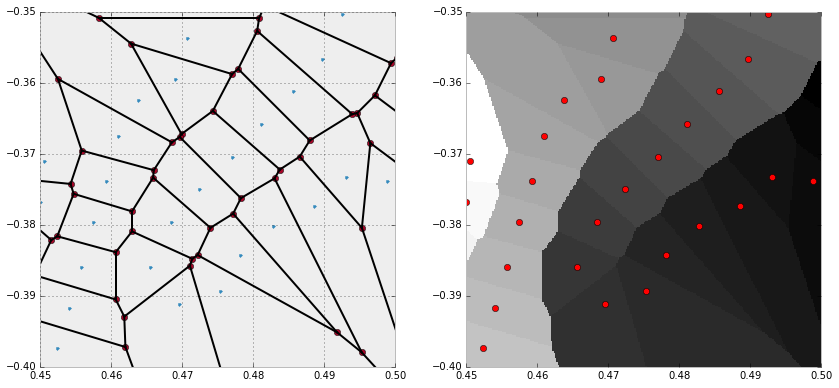

#### Range Searching

A _range searching problem_ tries to determine which objects of an input set
intersect with a query object (that we call the *range*).

For example, given a set of points in the plane, which ones are contained inside
a circle of radius `r` centered at a target location `Q`. We can solve this
sample problem easily with the attribute `query_ball_point` from a suitable
implementation of a k-d tree.  We can go even further: if the range is an object
formed by the intersection of a sequence of different balls, the same attribute
gets the job done, as the following code illustrates.

    points = np.random.rand(320, 2)
    range_points = np.random.rand(5, 2)
    range_radii = 0.1 * np.random.rand(5)
    
    tree = cKDTree(points)
    result = set()
    
    for k in range(5):
        point  = range_points[k]
        radius = range_radii[k]
        partial_query = tree.query_ball_point(point, radius)
        result = result.union(set(partial_query))
        
    print result
        
    fig = plt.figure(figsize=(9, 9))
    plt.axes().set_aspect('equal')
    for point in points:
        plt.plot(point[0], point[1], 'ko')
        
    for k in range(5):
        point = range_points[k]
        radius = range_radii[k]
        circle = plt.Circle(point, radius, fill=False, color="red", lw=2)
        fig.gca().add_artist(circle)
        
    plt.show()

    set([192, 199, 204, 139, 140, 77, 144, 18, 280, 92, 287, 34, 164, 165, 295, 106, 171, 172, 173, 49, 178, 245, 186])

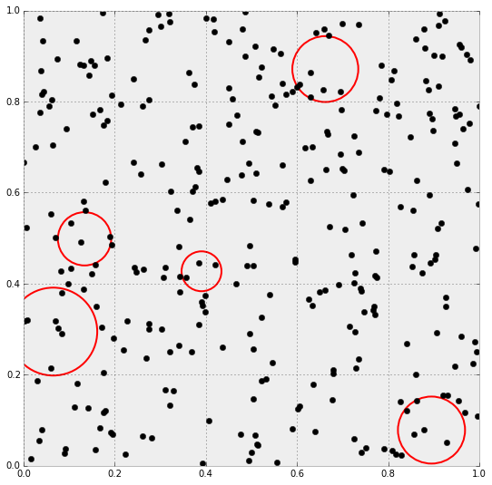

This gives the following diagram, where the small dots represent the locations
of the search space, and the circles are the range.  The query is, of course,
the 14 points located inside of the circles, that our algorithm computed.

Problems in this setting vary from trivial to extremely complicated, depending
on the input object types, range types, and query types.  An excellent
exposition of this subject is the survey paper _Geometric Range Searching and
its Relatives_, published by Pankaj K. Agarwal and Jeff Erickson in 1999, by the
American Mathematical Society Press, as part of the _Advances in Discrete and
Computational Geometry: proceedings of the 1996 AMS-IMS-SIAM joint summer
research conference, Discrete and Computational Geometry_.

### Dynamic Problems

A dynamic problem is regarded as any of the problems in the previous two
settings (static or query), but with the added challenge that objects are
constantly being inserted or deleted.  Besides solving the base problem, we need
to take extra measures to assure that the implementation is efficient with
respect to these changes.

To this effect, the implementations wrapped from the `Qhull` libraries in the
module `scipy.spatial` are equiped to deal with insertion of new points.   We
accomplish this by stating the option `incremental=True`, which basically
suppresses the `qhull` control `'Qz'`, and prepares the output structure for
these complex situations.

Let us illustrate with a simple example.  We start with the first ten vertices
of Lake Superior, and inserting ten vertices at a time, update the corresponding
triangulation and Voronoi diagrams.

    small_superior = lake_superior['vertices'][:9]
    
    tri = Delaunay(small_superior, incremental=True)
    vor = Voronoi(small_superior, incremental=True)

    plt.figure(figsize=(14,14))
    
    for k in range(4):
        tri.add_points(vertices_ls[10*(k+1):10*(k+2)-1])
        vor.add_points(vertices_ls[10*(k+1):10*(k+2)-1])
        ax1 = plt.subplot(4, 2, 2*k+1, aspect='equal')
        ax1.set_xlim( 0.00,  1.00)
        ax1.set_ylim(-0.70, -0.30)
        delaunay_plot_2d(tri, ax1)
        ax2 = plt.subplot(4, 2, 2*k+2, aspect='equal')
        ax2.set_xlim(0.0, 1.0)
        ax2.set_ylim(-0.70, -0.30)
        voronoi_plot_2d(vor, ax2)
        
    plt.show()

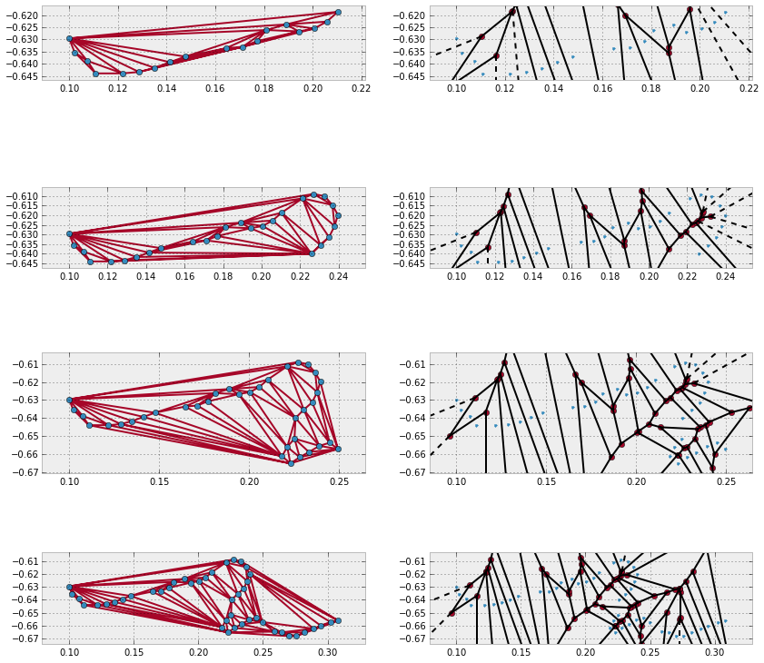

## Numerical Computational Geometry

This field arose simultaneously among different groups of researchers seeking
solutions to a priori non-related problems.  As it turns out, all the solutions
they posed did actually have an important common denominator: they were obtained
upon representing objects by means of parametric curves, parametric surfaces, or
regions bounded by those.   These scientists ended up unifying their techniques
over the years, to finally define the field of Numerical Computational Geometry.
In this journey, the field received different names: *Machine Geometry*,
*Geometric Modeling*, and the most widespread *Computer Aided Geometric Design*
(*CAGD*).

It is used in computer vision, for example, for 3D reconstruction and movement
outline.   It is widely employed for the design and qualitative analysis of  the
bodies of automobiles, aircraft, or watercraft.  There are many computer aided
design software packages (*CAD*) that facilitate interactive manipulation and
solution of many of the problems in this area.  In this regard, any interaction
with `python` gets relegated to being part of the underlying computational
engine behind the visualization or animation—which are none of the strengths of
`scipy`.  For this reason, we will not cover visualization or animation
applications in this book, and focus on the basic mathematics instead.

In that regard, the foundation of Numerical Computational Geometry is based on
three key concepts: Bézier surfaces, Coons patches, and B-spline methods.   In
turn, the theory of Bézier curves plays a central role in the development of
these concepts.  They are the geometric standard for the representation of
piecewise polynomial curves.  In this section we focus solely on the basic
development of the theory of plane Bézier curves.

> The rest of the material is also beyond the scope of `scipy`, and we therefore
leave its exposition to more technical books.  The best source in that sense is,
without a doubt, the book _Curves and Surfaces for Computer Aided Geometric
Design—A Practical Guide_ (5th ed.), by Gerald Farin, published by Academic
Press under the Morgan Kauffman Series in Computer Graphics and Geometric
Modeling.

### Bézier Curves

It all starts with the *de Casteljau Algorithm* to construct parametric
equations of an arc of a polynomial of order 3.  In the submodule
`matplotlib.path`  we have an implementation of this algorithm using the class
`Path`, which we can use to generate our own user-defined routines to generate
and plot plane Bézier curves.

> For information about the class `Path` and its usage within the `matplotlib`
libraries, refer to the official documentation at [matplotlib.org/api/path_api.h
tml#matplotlib.path.Path](matplotlib.org/api/path_api.html#matplotlib.path.Path)
, as well as the very instructive tutorial at [matplotlib.org/users/path_tutoria
l.html](matplotlib.org/users/path_tutorial.html).  In this section, we focus
solely on the necessary material to deal with Bézier curves.

Before we proceed, we need some basic code to represent and visualize Bézier
curves:

* The de Casteljau algorithm for arcs of polynomials of order 2 is performed by
creating a `Path` with the three control points as vertices, and the list
`[Path.MOVETO, Path.CURVE3, Path.CURVE3]` as code.  This ensures that the
resulting curve starts at `P1` in the direction given by the segment `P1P2`, and
ends at `P3` with direction given by the segment `P2P3`.  If the three points
are collinear, we obtain a segment containing them all.  Otherwise, we obtain an
arc of parabola.

* The de Casteljau algorithm for arcs of polynomials of order 3 is performed in
a similar way to the previous case.  We have four control points, and we create
a `Path` with those as vertices.  The code is the list `[Path.MOVETO,
Path.CURVE4, Path.CURVE4, Path.CURVE4]`, which ensures that the arc starts at
`P1` with direction given by the segment `P1P2`.  It also ensures that the arc
ends at `P4` in the direction of the segment `P3P4`.

    import matplotlib.patches as patches
    
    def bezier_parabola(P1, P2, P3):
       return Path([P1, P2, P3],
                   [Path.MOVETO, Path.CURVE3, Path.CURVE3])
    
    def bezier_cubic(P1, P2, P3, P4):
        return Path([P1, P2, P3, P4],
                    [Path.MOVETO, Path.CURVE4, Path.CURVE4, Path.CURVE4])
    
    def plot_path(path, labels=None):
        Xs, Ys = zip(*path.vertices)
        fig = plt.figure()
        ax  = fig.add_subplot(111, aspect='equal')
        ax.set_xlim(min(Xs)-0.2, max(Xs)+0.2)
        ax.set_ylim(min(Ys)-0.2, max(Ys)+0.2)
        patch = patches.PathPatch(path, facecolor='black', linewidth=2)
        ax.add_patch(patch)
        ax.plot(Xs, Ys, 'o--', color='blue', linewidth=1)
        if labels:
            for k in range(len(labels)):
                ax.text(path.vertices[k][0]-0.1,
                    path.vertices[k][1]-0.1, 
                    labels[k])
        plt.show()

Let us test it with a few basic examples:

    P1 = (0.0, 0.0)
    P2 = (1.0, 1.0)
    P3 = (2.0, 0.0)
    path_1 = bezier_parabola(P1, P2, P3)
    plot_path(path_1, labels=['P1', 'P2', 'P3'])

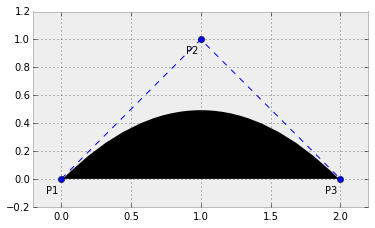

    P4 = (2.0, -1.0)
    P5 = (3.0, 0.0)
    path_2 = bezier_cubic(P1, P2, P4, P5)
    plot_path(path_2, labels=['P1', 'P2', 'P4', 'P5'])

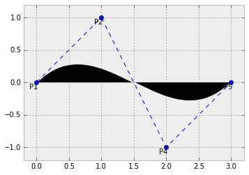

Higher degree curves are computationally expensive to evaluate.  When complex
paths are needed, we rather create them as a piecewise sequence of low order
Bézier patched together---we call this object a *Bézier spline*.   Notice it is
not hard to guarantee continuity on these splines.  It is enough to make the end
of each path the starting point of the next one.  It is also easy to guarantee
smoothness (at least up to the first derivative), by making the last two control
points of one curve be aligned with the first two control points of the next
one.  Let us illustrate this with an example.

    Q1 = P5
    Q2 = (4.0, 0.0)
    Q3 = (5.0, -1.0)
    Q4 = (6.0, 0.0)
    path_3 = bezier_cubic(P1, P2, P3, P5)
    path_4 = bezier_cubic(Q1, Q2, Q3, Q4)
    plot_path(Path.make_compound_path(path_3, path_4))

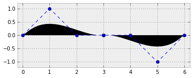

A clear advantage of representing curves as Bézier splines arises when we need
to apply an affine transformation to a curve.  For instance, if we required a
counter-clockwise rotated version of the last curve computed, instead of
performing the operation over all points of the curve, we simply apply the
transformation to the control points, and repeat the de Casteljau algorithm on
the new controls.

    def rotation(point, angle):
        return (np.cos(angle)*point[0] - np.sin(angle)*point[1], 
                np.sin(angle)*point[0] + np.cos(angle)*point[1])

    new_Ps = [rotation(P, np.pi/3) for P in path_3.vertices]
    new_Qs = [rotation(Q, np.pi/3) for Q in path_4.vertices]
    path_5 = bezier_cubic(*new_Ps)
    path_6 = bezier_cubic(*new_Qs)
    plot_path(Path.make_compound_path(path_5, path_6))

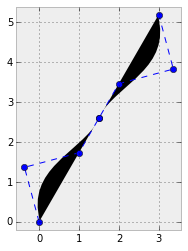

## Summary

we have developed a brief incursion in the field of Computational Geometry, and
we have mastered all the tools coded in the `scipy` stack to effectively address
the most common problems in this topic.

    from IPython.core.display import HTML
    
    def css_styling():
        styles = open("../styles/custom.css", "r").read()
        return HTML(styles)
    css_styling()

    
